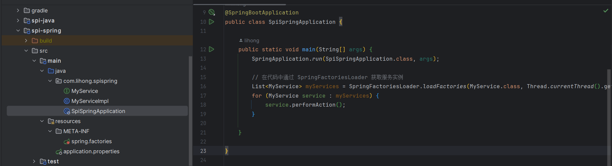

# SPI机制在Java和Spring中的应用

>我编写这篇博客的主要原因是为了==帮助理解springboot中spring.factories中自动装配的原理==
>
>github地址：[lihongzy/spi (github.com)](https://github.com/lihongzy/spi)

## 什么是SPI机制

>在 Java 中，==SPI 指的是"Service Provider Interface"==，它是一种在 Java 平台上的服务提供者框架。SPI 机制允许开发者定义服务接口，并通过一种松耦合的方式将接口的实现与服务提供者关联起来。SPI 主要用于在运行时发现和加载模块化的、可插拔的组件。

SPI机制整体机制图如下：


以下是 SPI 机制的基本工作原理：

1. **定义接口**：开发者首先定义一个接口，描述一种服务或功能。

   ```java
   // 服务接口
   public interface MyService {
       void performAction();
   }
   ```

2. **编写实现**：然后，不同的开发者可以提供不同的实现，这些实现都要实现上述定义的接口。

```java
// 服务提供者实现
public class MyServiceImpl implements MyService {
    @Override
    public void performAction() {
        // 具体实现
        System.out.println("在MyServiceImpl中执行操作");
    }
}
```

3.  **META-INF/services 目录：** 接下来，在项目的 `META-INF/services` 目录下创建一个以接口全名为名字的文件，文件的内容是实现类的全名。

```shell
# META-INF/services/com.example.MyService
com.example.MyServiceImpl
```

4. **运行时加载：** Java 运行时环境会自动查找这个文件，加载并实例化实现类，从而使得服务可以在运行时被发现和调用。

```java
// 在代码中通过 ServiceLoader 获取服务实例
ServiceLoader<MyService> serviceLoader = ServiceLoader.load(MyService.class);
for (MyService service : serviceLoader) {
    service.performAction(); // 调用服务
}
```

SPI 机制使得应用程序可以在运行时动态地加载模块或插件，而不需要在编译时硬编码这些实现。这种机制在许多 Java 标准库和框架中得到了广泛应用，例如 Java Database Connectivity (JDBC)、Java Cryptography Architecture (JCA) 等。

代码结构：


运行结果：


## SPI机制在Spring中的应用

在springboot中也有一种类似的加载机制，它在META-INF/spring.factories文件中配置接口的实现名称，然后在程序中读取这些配置文件并实例化。

这种自定义的SPI机制就是SpringBoot starter实现的基础。

spring-core包里定义了SpringFactoriesLoader类，这个类实现了检索META-INF/spring.factories文件，并获取指定接口的配置的功能。

举例：

1. **定义接口**：开发者首先定义一个接口，描述一种服务或功能。

   ```java
   // 服务接口
   public interface MyService {
       void performAction();
   }
   ```

2. **编写实现**：然后，不同的开发者可以提供不同的实现，这些实现都要实现上述定义的接口。

```java
// 服务提供者实现
public class MyServiceImpl implements MyService {
    @Override
    public void performAction() {
        // 具体实现
        System.out.println("在MyServiceImpl中执行操作");
    }
}
```

3.  **META-INF/spring.factories文件：** 接下来，在项目的 `META-INF/spring.factories` 文件中定义 接口引用=接口实现类引用

```shell
com.lihong.spispring.MyService=com.lihong.spispring.MyServiceImpl
```

4. **运行时加载：** Spring运行时环境会自动查找这个文件，加载并实例化实现类，从而使得服务可以在运行时被发现和调用。

```java
        // 在代码中通过 SpringFactoriesLoader 获取服务实例
        List<MyService> myServices = SpringFactoriesLoader.loadFactories(MyService.class, Thread.currentThread().getContextClassLoader());
        for (MyService service : myServices) {
            service.performAction();
        }
```

代码结构：


