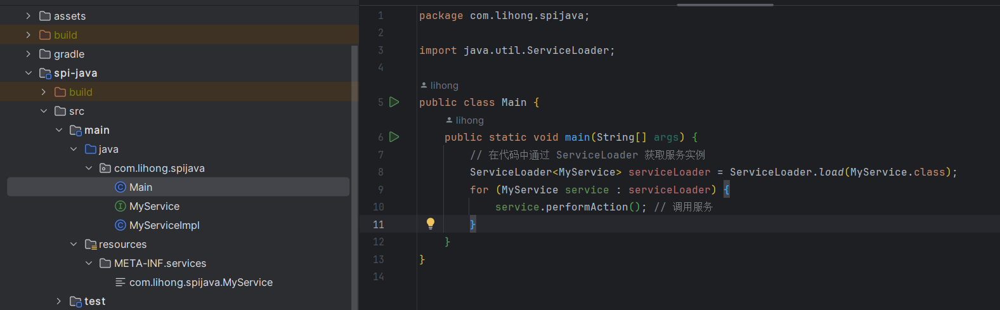

# SPI机制在Java和Spring中的应用

>我编写这篇博客的主要原因是为了==帮助理解springboot中spring.factories中自动装配的原理以及网上文章对他的误解==
>
>所有代码都在github上——github地址：[lihongzy/spi (github.com)](https://github.com/lihongzy/spi)

## 什么是SPI机制

>在 Java 中，==SPI 指的是"Service Provider Interface"==，它是一种在 Java 平台上的服务提供者框架。SPI 机制允许开发者定义服务接口，并通过一种松耦合的方式将接口的实现与服务提供者关联起来。SPI 主要用于在运行时发现和加载模块化的、可插拔的组件。

SPI机制整体机制图如下：


以下是 SPI 机制的基本工作原理：

1. **定义接口**：开发者首先定义一个接口，描述一种服务或功能。

   ```java
   // 服务接口
   public interface MyService {
       void performAction();
   }
   ```

2. **编写实现**：然后，不同的开发者可以提供不同的实现，这些实现都要实现上述定义的接口。

```java
// 服务提供者实现
public class MyServiceImpl implements MyService {
    @Override
    public void performAction() {
        // 具体实现
        System.out.println("在MyServiceImpl中执行操作");
    }
}
```

3.  **META-INF/services 目录：** 接下来，在项目的 `META-INF/services` 目录下创建一个以接口全名为名字的文件，文件的内容是实现类的全名。

```shell
# META-INF/services/com.example.MyService
com.example.MyServiceImpl
```

4. **运行时加载：** Java 运行时环境会自动查找这个文件，加载并实例化实现类，从而使得服务可以在运行时被发现和调用。

```java
// 在代码中通过 ServiceLoader 获取服务实例
ServiceLoader<MyService> serviceLoader = ServiceLoader.load(MyService.class);
for (MyService service : serviceLoader) {
    service.performAction(); // 调用服务
}
```

SPI 机制使得应用程序可以在运行时动态地加载模块或插件，而不需要在编译时硬编码这些实现。这种机制在许多 Java 标准库和框架中得到了广泛应用，例如 Java Database Connectivity (JDBC)、Java Cryptography Architecture (JCA) 等。

代码结构：



运行结果：


## SPI机制在Spring中的应用

> **注意**：在springboot中自从2.7.x（好像是，不记得了）已经移除了通过spring.factories自动注入而是通过org.springframework.boot.autoconfigure.AutoConfiguration.imports来实现自动注入可以参考我github上的例子：[lihongzy/spi (github.com)](https://github.com/lihongzy/spi)

在springboot中也有一种类似的加载机制，它在META-INF/spring.factories文件中配置接口的实现名称，然后在程序中读取这些配置文件并实例化。

这种自定义的SPI机制就是SpringBoot starter实现的基础。

spring-core包里定义了SpringFactoriesLoader类，这个类实现了检索META-INF/spring.factories文件，并获取指定接口的配置的功能。

举例：

1. **定义接口**：开发者首先定义一个接口，描述一种服务或功能。

   ```java
   // 服务接口
   public interface MyService {
       void performAction();
   }
   ```

2. **编写实现**：然后，不同的开发者可以提供不同的实现，这些实现都要实现上述定义的接口。

```java
// 服务提供者实现
public class MyServiceImpl implements MyService {
    @Override
    public void performAction() {
        // 具体实现
        System.out.println("在MyServiceImpl中执行操作");
    }
}
```

3.  **META-INF/spring.factories文件：** 接下来，在项目的 `META-INF/spring.factories` 文件中定义 接口引用=接口实现类引用

```shell
com.lihong.spispring.MyService=com.lihong.spispring.MyServiceImpl
```

4. **运行时加载：** Spring运行时环境会自动查找这个文件，加载并实例化实现类，从而使得服务可以在运行时被发现和调用。

```java
        // 在代码中通过 SpringFactoriesLoader 获取服务实例
        List<MyService> myServices = SpringFactoriesLoader.loadFactories(MyService.class, Thread.currentThread().getContextClassLoader());
        for (MyService service : myServices) {
            service.performAction();
        }
```

代码结构：


运行结果：


## spring-boot-autoconfigure包中的spring.factories文件

在Spring Boot 的很多包中都能够找到spring.factories，下面就是spring-boot-autoconfigure 包中的spring.factories文件

```shell
# ApplicationContext Initializers
org.springframework.context.ApplicationContextInitializer=\
org.springframework.boot.autoconfigure.SharedMetadataReaderFactoryContextInitializer,\
org.springframework.boot.autoconfigure.logging.ConditionEvaluationReportLoggingListener

# Application Listeners
org.springframework.context.ApplicationListener=\
org.springframework.boot.autoconfigure.BackgroundPreinitializer

# Environment Post Processors
org.springframework.boot.env.EnvironmentPostProcessor=\
org.springframework.boot.autoconfigure.integration.IntegrationPropertiesEnvironmentPostProcessor

# Auto Configuration Import Listeners
org.springframework.boot.autoconfigure.AutoConfigurationImportListener=\
org.springframework.boot.autoconfigure.condition.ConditionEvaluationReportAutoConfigurationImportListener

# Auto Configuration Import Filters
org.springframework.boot.autoconfigure.AutoConfigurationImportFilter=\
org.springframework.boot.autoconfigure.condition.OnBeanCondition,\
org.springframework.boot.autoconfigure.condition.OnClassCondition,\
org.springframework.boot.autoconfigure.condition.OnWebApplicationCondition

# Failure Analyzers
org.springframework.boot.diagnostics.FailureAnalyzer=\
org.springframework.boot.autoconfigure.data.redis.RedisUrlSyntaxFailureAnalyzer,\
org.springframework.boot.autoconfigure.diagnostics.analyzer.NoSuchBeanDefinitionFailureAnalyzer,\
org.springframework.boot.autoconfigure.flyway.FlywayMigrationScriptMissingFailureAnalyzer,\
org.springframework.boot.autoconfigure.jdbc.DataSourceBeanCreationFailureAnalyzer,\
org.springframework.boot.autoconfigure.jdbc.HikariDriverConfigurationFailureAnalyzer,\
org.springframework.boot.autoconfigure.jooq.NoDslContextBeanFailureAnalyzer,\
org.springframework.boot.autoconfigure.r2dbc.ConnectionFactoryBeanCreationFailureAnalyzer,\
org.springframework.boot.autoconfigure.r2dbc.MissingR2dbcPoolDependencyFailureAnalyzer,\
org.springframework.boot.autoconfigure.r2dbc.MultipleConnectionPoolConfigurationsFailureAnalyzer,\
org.springframework.boot.autoconfigure.r2dbc.NoConnectionFactoryBeanFailureAnalyzer

# Template Availability Providers
org.springframework.boot.autoconfigure.template.TemplateAvailabilityProvider=\
org.springframework.boot.autoconfigure.freemarker.FreeMarkerTemplateAvailabilityProvider,\
org.springframework.boot.autoconfigure.mustache.MustacheTemplateAvailabilityProvider,\
org.springframework.boot.autoconfigure.groovy.template.GroovyTemplateAvailabilityProvider,\
org.springframework.boot.autoconfigure.thymeleaf.ThymeleafTemplateAvailabilityProvider,\
org.springframework.boot.autoconfigure.web.servlet.JspTemplateAvailabilityProvider

# DataSource Initializer Detectors
org.springframework.boot.sql.init.dependency.DatabaseInitializerDetector=\
org.springframework.boot.autoconfigure.flyway.FlywayMigrationInitializerDatabaseInitializerDetector

# Depends on Database Initialization Detectors
org.springframework.boot.sql.init.dependency.DependsOnDatabaseInitializationDetector=\
org.springframework.boot.autoconfigure.batch.JobRepositoryDependsOnDatabaseInitializationDetector,\
org.springframework.boot.autoconfigure.quartz.SchedulerDependsOnDatabaseInitializationDetector,\
org.springframework.boot.autoconfigure.session.JdbcIndexedSessionRepositoryDependsOnDatabaseInitializationDetector

```

==**注意**==：在高版本的springboot中已经不支持通过spring.factories机制来自动注入组件，而是通过==org.springframework.boot.autoconfigure.AutoConfiguration.imports==该文件来实现
